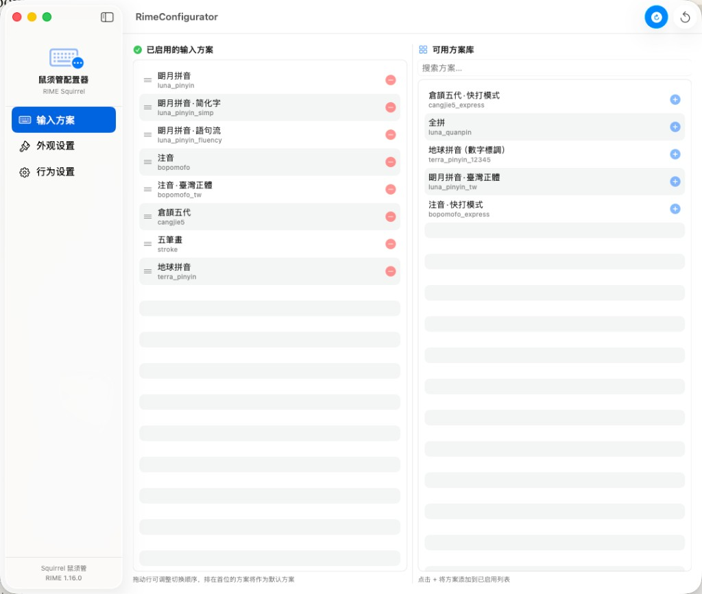
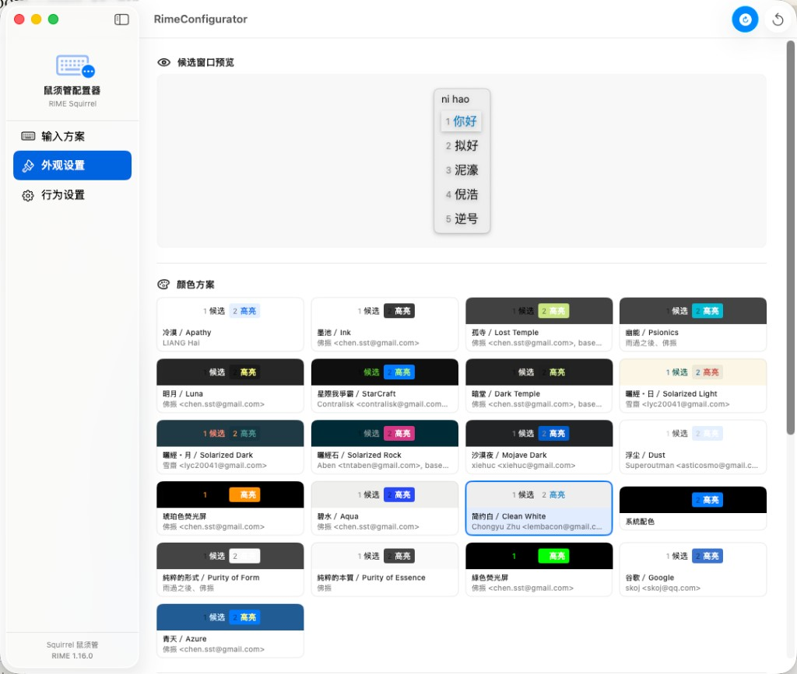

# RimeConfigurator · 鼠须管配置器 · 鼠鬚管配置器

**简体中文**  
用于在 macOS 上图形化配置 [鼠须管 Squirrel](https://github.com/rime/squirrel)（RIME 输入法引擎）的原生应用。无需手改 YAML，即可在同一窗口管理输入方案、调整外观与行为。

**繁體中文**  
在 macOS 上以圖形介面設定 [鼠鬚管 Squirrel](https://github.com/rime/squirrel)（RIME 輸入法引擎）的原生 App。不必手動編輯 YAML，即可在同一視窗管理輸入方案、調整外觀與行為。

**English**  
A native macOS GUI for configuring [Squirrel](https://github.com/rime/squirrel), the RIME input method engine on macOS. Manage input schemas, appearance, and behavior in one window—no hand-editing YAML.

> **简体中文** 需要 macOS 13 Ventura 或更高版本；须已安装鼠须管。  
> **繁體中文** 需要 macOS 13 Ventura 或更新版本；須已安裝鼠鬚管。  
> **English** Requires macOS 13 Ventura or later. Squirrel must already be installed.

**下载 · 下載 · Download**
- **简体中文**：[下载最新版本 v0.2.0](https://github.com/bryanzk/RimeConfigurator/releases/tag/v0.2.0) · [直接下载 Apple Silicon 安装包](https://github.com/bryanzk/RimeConfigurator/releases/download/v0.2.0/RimeConfigurator-0.2.0-macos-arm64.zip)
- **繁體中文**：[下載最新版本 v0.2.0](https://github.com/bryanzk/RimeConfigurator/releases/tag/v0.2.0) · [直接下載 Apple Silicon 安裝包](https://github.com/bryanzk/RimeConfigurator/releases/download/v0.2.0/RimeConfigurator-0.2.0-macos-arm64.zip)
- **English**: [Latest release v0.2.0](https://github.com/bryanzk/RimeConfigurator/releases/tag/v0.2.0) · [Direct Apple Silicon download](https://github.com/bryanzk/RimeConfigurator/releases/download/v0.2.0/RimeConfigurator-0.2.0-macos-arm64.zip)

---

## 功能 · Features

**简体中文**
- **输入方案**：查看 `~/Library/Rime` 与 Squirrel SharedSupport 中的方案；一键启用/禁用；拖拽排序（首位为默认）；在方案库中按名称或 ID 搜索。
- **外观**：实时候选窗预览；从卡片网格选择配色（来自 `squirrel.yaml`）；候选字/标签字体与字号；候选纵向/横向排列；文字横排/竖排；圆角、行距、间距、阴影等几何项；在线预编辑、候选内嵌、磨砂透明、翻页按钮等开关。
- **行为**：每页候选数量（1–9）；界面语言切换（简中 / 繁中 / 英文）；按应用覆盖（`app_options`），可为终端、编辑器等单独设置默认英文、内嵌候选、禁用内嵌、Vim 模式；一键在访达中打开 Rime 配置目录。
- **保存与部署**：**⌘⇧R** 或工具栏按钮写入配置并触发重新部署；保存后可查看写入磁盘的 YAML（`squirrel.custom.yaml`、`default.custom.yaml`）；保存结果会区分自动生效、已请求自动部署或仍需手动部署。
- **安全试错**：显示环境诊断、未保存修改提示、放弃修改确认，以及外观/行为默认值重置，降低误操作成本。

**繁體中文**
- **輸入方案**：檢視 `~/Library/Rime` 與 Squirrel SharedSupport 內的方案；一鍵啟用/停用；拖曳排序（第一個為預設）；在方案庫依名稱或 ID 搜尋。
- **外觀**：即時候選視窗預覽；從卡片網格選擇配色（來自 `squirrel.yaml`）；候選字/標籤字型與字級；候選直向/橫向排列；文字橫排/直排；圓角、行距、間距、陰影等幾何設定；線上預編輯、候選內嵌、磨砂透明、翻頁按鈕等開關。
- **行為**：每頁候選數量（1–9）；介面語言切換（簡中 / 繁中 / 英文）；按 App 覆寫（`app_options`），可為終端機、編輯器等單獨設定預設英文、內嵌候選、停用內嵌、Vim 模式；一鍵在 Finder 中開啟 Rime 設定目錄。
- **儲存與部署**：**⌘⇧R** 或工具列按鈕寫入設定並觸發重新部署；儲存後可檢視寫入磁碟的 YAML（`squirrel.custom.yaml`、`default.custom.yaml`）；儲存結果會區分自動生效、已要求自動重新部署，或仍需手動重新部署。
- **安全試錯**：顯示環境診斷、未儲存修改提示、放棄修改確認，以及外觀／行為預設值重設，降低誤操作成本。

**English**
- **Input schemas**: Lists schemas in `~/Library/Rime` and Squirrel’s SharedSupport; enable/disable in one click; drag to reorder (first = default); search the library by name or schema ID.
- **Appearance**: Live candidate-window preview; color schemes from a card grid (from `squirrel.yaml`); candidate & label fonts; stacked vs linear layout; text orientation; geometry sliders; toggles for inline preedit, inline candidate, translucency, paging.
- **Behavior**: Candidates per page (1–9); interface language switching (Simplified Chinese / Traditional Chinese / English); per-app overrides (`app_options`) for terminals and editors, including default English mode, inline candidates, disabling inline mode, and Vim mode; open the Rime config folder in Finder.
- **Save & deploy**: **⌘⇧R** or the toolbar writes config and triggers redeploy; after save, a sheet shows YAML written to `squirrel.custom.yaml` and `default.custom.yaml`; save feedback distinguishes between auto-applied changes, auto-redeploy requested, and manual redeploy required.
- **Safer editing**: Environment diagnostics, unsaved-change indicators, discard-confirmation flow, and reset-to-default actions for appearance and behavior.

---

## 截图 · Screenshots

| 输入方案 · 輸入方案 · Input schemas | 外观 · 外觀 · Appearance | 行为 · 行為 · Behavior |
|-------------------------------------|---------------------------|------------------------|
|  |  |  |

---

## 系统要求 · Requirements

| 简体中文 | 繁體中文 | English |
|----------|----------|---------|
| macOS 13 Ventura 或更高 | macOS 13 Ventura 或更新 | macOS 13 Ventura or later |
| 已安装鼠须管（较新版本即可） | 已安裝鼠鬚管（近期版本即可） | Squirrel installed (any recent version) |
| Xcode / Swift 5.9+ | Xcode / Swift 5.9+ | Xcode / Swift 5.9+ |

---

## 构建与运行 · Build & Run

```bash
git clone https://github.com/bryanzk/RimeConfigurator.git
cd RimeConfigurator
swift run
```

**简体中文** 或在 Xcode 中打开 `Package.swift`，按 **⌘R** 编译运行。  
**繁體中文** 或在 Xcode 中開啟 `Package.swift`，按 **⌘R** 建置並執行。  
**English** Or open `Package.swift` in Xcode and press **⌘R** to build and run.

```bash
open Package.swift
```

---

## 工作原理 · How It Works

RimeConfigurator 读写标准 Rime 用户目录 · RimeConfigurator 讀寫標準 Rime 使用者目錄 · RimeConfigurator reads and writes the standard Rime user directory:

| 文件 · 檔案 · File | 用途 · 用途 · Purpose |
|--------------------|----------------------|
| `~/Library/Rime/squirrel.custom.yaml` | 外观与行为覆盖 · 外觀與行為覆寫 · Appearance & behavior overrides |
| `~/Library/Rime/default.custom.yaml` | 方案列表与每页候选数 · 方案清單與每頁候選數 · Schema list & page size |
| `~/Library/Rime/*.schema.yaml` | 用户已安装方案（只读）· 使用者已安裝方案（唯讀）· Installed user schemas (read-only) |
| `/Library/Input Methods/Squirrel.app/…/SharedSupport/` | 内置方案与配色（只读）· 內建方案與配色（唯讀）· Built-in schemas & color schemes (read-only) |

**简体中文** 保存后会向 Squirrel 发送分布式通知以触发重新部署；若通知未送达，会触碰 `installation.yaml` 并尝试以 Squirrel 的 `--reload` 作为后备。  
**繁體中文** 儲存後會向 Squirrel 發送分散式通知以觸發重新部署；若通知未送達，會觸碰 `installation.yaml` 並嘗試以 Squirrel 的 `--reload` 作為後備。  
**English** After saving, it posts a distributed notification to Squirrel for redeploy; if that fails, it touches `installation.yaml` and tries invoking Squirrel with `--reload` as a fallback.

> **简体中文** `app_options` 已支持在「行为」页图形化配置；如需高级字段，仍可直接编辑 `squirrel.custom.yaml`。  
> **繁體中文** `app_options` 已支援在「行為」頁以圖形介面設定；若需進階欄位，仍可直接編輯 `squirrel.custom.yaml`。  
> **English** `app_options` can now be configured from the Behavior tab; for advanced fields, you can still edit `squirrel.custom.yaml` directly.

---

## 依赖 · Dependencies

- [Yams](https://github.com/jpsim/Yams) — YAML 解析与序列化 · YAML 解析與序列化 · YAML parsing & serialization

---

## 许可证 · License

MIT
